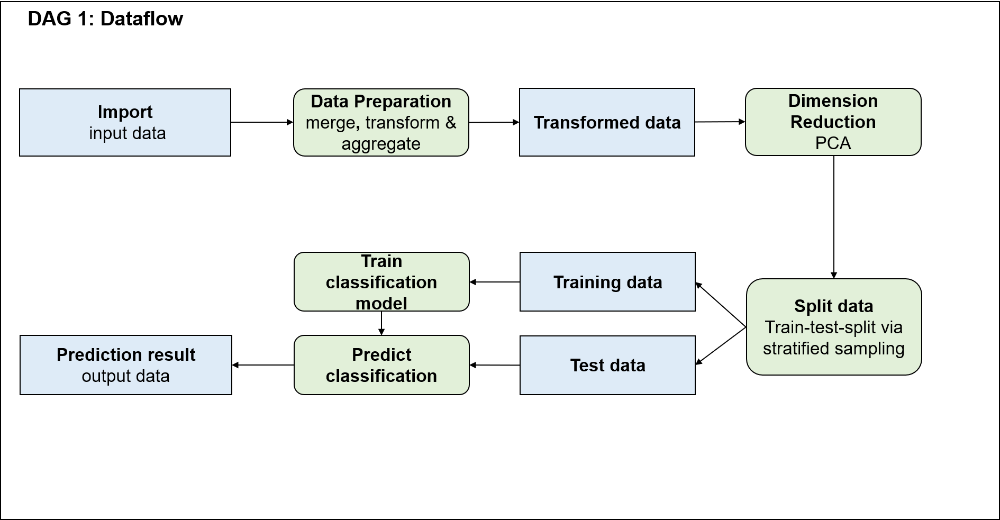

# Project Name and Target

Name: Cancellation Prevention

Course: Advanced Data Science and Machine Learning Project

Dataset: https://www.kaggle.com/olistbr/brazilian-ecommerce

Target:
This project aims to predict order cancellations within the brazilian Olist eCommerce dataset.
Following a binary classification approach based on existing order data with the target variable "order status",
a prediction on new data should be enabled. Therefore possible order cancellations could be detected and classified early on and countermeasures could be set up to reduce or prevent them.
Finally, this approach should lead to an increase of successful order deliveries, ultimately resulting in higher sales (e.g. because of more successfully delivered orders),
cost savings (e.g. due to less customer service efforts) and increased customer satisfaction and retention (e.g. due to less problems occurring in the ordering process).

# Structure

The project structure is depicted by using Directed Acyclic Graphs (DAGs).

DAG_1 shows the general dataflow of the project.

DAG_2 describes the technical program flow.

DAG_3 considers the human workflow that goes in parallel with the technical implementation:

